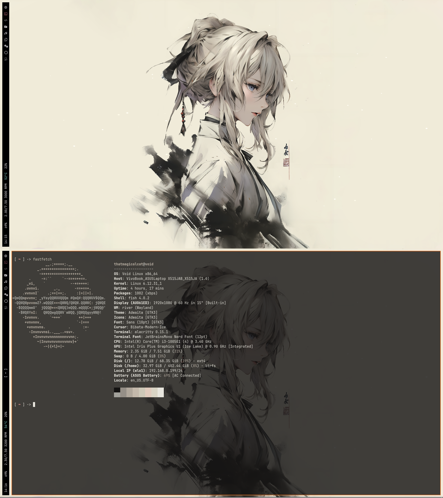
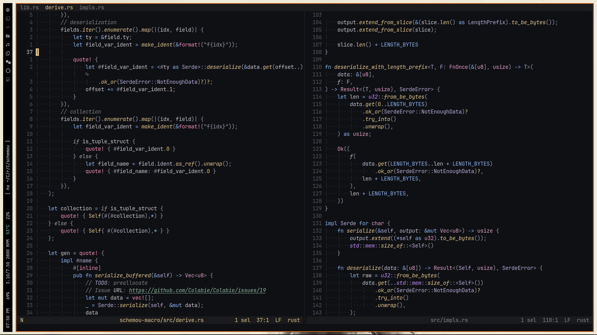
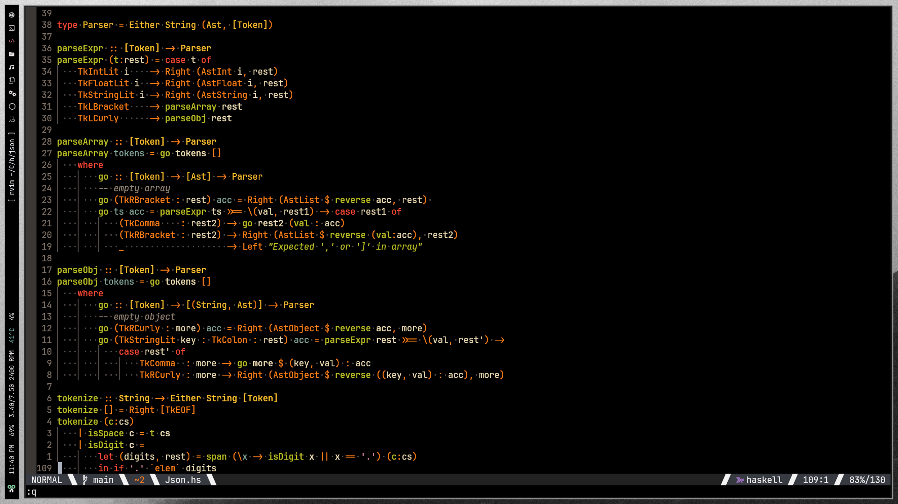

# .Files

# Current River config

1. Terminal - alacritty/kitty
2. Text Editor - neovim
3. Fetch - [tinyfetch](https://github.com/thatmagicalcat/tinyfetch)

## previous dwm config
### Screenshots:

